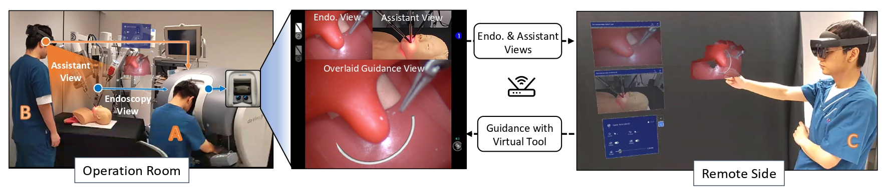

<br />
<p align="center">

  <h1 align="center">Extended Reality with HMD-Assisted Guidance and Console 3D Overlay for Robotic Surgery Remote Mentoring</h1>

  <p align="center">
   RA-L 2024
    <br />
    <a href="https://chengkunli96.github.io/"><strong>Chengkun Li</strong></a>
    ·
    <a href="https://dblp.org/pid/239/9969.html"><strong>Yuqi Tong</strong></a>
    ·
    <a href="https://scholar.google.com/citations?user=HIjQdFQAAAAJ&hl=en"><strong>Yonghao Long</strong></a>
    ·
    <a href="https://scholar.google.com/citations?user=E4efwTgAAAAJ&hl=en"><strong>Weixin Si</strong></a>
    ·
    <a href="https://scholar.google.com/citations?user=PpzjA8UAAAAJ&hl=en"><strong>David Chun Man Yeung</strong></a> 
    <br />
    ·
    <a href="https://www.med.cuhk.edu.hk/staff/dr-chan-ying-kuen-jason"><strong>Jason Ying-Kuen Chan</strong></a>
    ·
    <a href="http://www.cse.cuhk.edu.hk/~qdou/"><strong>Qi Dou</strong></a>
  </p>

<!-- <p align="center"> 

</p> -->

  <p align="center">
    <!-- <a href='https://xxxxxxxx'>
      </a> -->
    <a href='https://chengkunli96.github.io/RMS-XR/' style='padding-left: 0.5rem;'></a>
    <a href='https://chengkunli96.github.io/RMS-XR/' style='padding-left: 0.5rem;'></a>
    <!-- <a href='https://colab.research.google.com/drive/1imGIms3Y4RRtddA6IuxZ9bkP7N2gVVC_' style='padding-left: 0.5rem;'></a> -->
    <!-- <a href='https://youtu.be/lCc1rHePEFQ' style='padding-left: 0.5rem;'>
      </a> -->
  </p>

</p>
<br />

This repository is for the paper [Extended Reality with HMD-Assisted Guidance and Console 3D Overlay for Robotic Surgery Remote Mentoring](https://ieeexplore.ieee.org/document/10669229), RA-L 2024. In this paper, we propose an extended reality (XR) remote mentoring system for robotic surgery. The system employs an optical see-through head-mounted display (OST-HMD) to provide real-time 3D endoscopic visualization and enable remote mentors to offer surgical guidance through natural hand gestures and virtual surgical instruments.

## Overview


The prototype of our extended reality telementoring system. <span style='color: orange;'>A</span> is the console surgeon who operates the robotic arms to conduct the surgery. <span style='color: orange;'>B</span> is the local assistant, and his view will be transmitted to the console surgeon and remote mentor sides to enrich operation information. <span style='color: orange;'>C</span> is the remote mentor who monitors the surgery procedure and provides surgical guidance through natural hand gestures with built-in virtual surgical instruments in XR space.

## Code
The official implementation of this project has been trasnfered to [project](https://github.com/med-air/RMS-XR) under [Med-AIR](https://github.com/med-air).

## 📝 Citation
Welcom to cite our work, If you find it is useful for your research.
```bibtex
@article{li2024extended,
  title={Extended reality with HMD-assisted guidance and console 3d overlay for robotic surgery remote mentoring},
  author={Li, Chengkun and Tong, Yuqi and Long, Yonghao and Si, Weixin and Yeung, David Chun Man and Chan, Jason Ying-Kuen and Dou, Qi},
  journal={IEEE Robotics and Automation Letters},
  year={2024},
  publisher={IEEE}
}
```

## 🙋‍♀️ Feedback and Contact
For further questions, pls feel free to contact [Chengkun Li](mailto:chengkunli@link.cuhk.edu.hk) or [Med-AIR](https://github.com/med-air).
